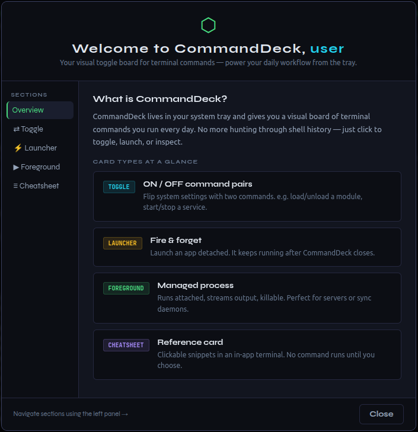
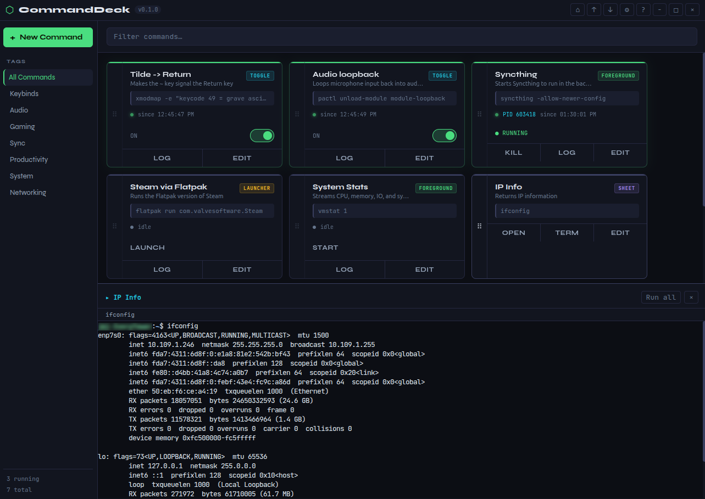
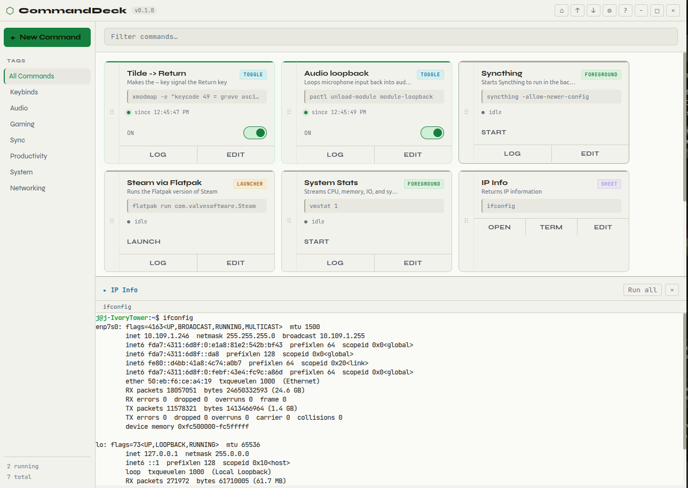

# ⬡ CommandDeck

A toggle board for terminal commands. Stop hunting through shell history — manage your daily commands with a click.

  

---



The CommandDeck main window showing a board of commands - dark theme:


Light theme:


---

## What it does

CommandDeck sits in your system tray and gives you a visual board of commands you run regularly. Three command types are supported:

| Type | How it works | Example |
|---|---|---|
| **Toggle** | ON command to activate, OFF command to deactivate | `pactl load-module ...` / `pactl unload-module ...` |
| **Launcher** | Fires and detaches (the app lives on its own) | `flatpak run com.valveSoftware.Steam` |
| **Foreground** | Runs managed — output is captured, PID tracked, killable | `syncthing -allow-newer-config` |
| **Cheatsheet** | Reference card — open snippets in an in-app terminal or your system terminal | `ip addr show`, `ss -tulnp` |

Features:
- ✅ System tray — minimize to tray, always reachable
- ✅ PID tracking & timestamps for running processes
- ✅ Kill button for any running process
- ✅ Output log capture (foreground commands)
- ✅ Log files saved to `~/.commanddeck/logs/`
- ✅ Config saved to `~/.commanddeck/commands.json` (plain JSON, version-control friendly)
- ✅ Export / Import config
- ✅ Multi-tag commands, sidebar tag filter, drag-to-reorder cards
- ✅ Toggle state persists across restarts (auto-restore on startup)
- ✅ Global hotkey to show/hide window (configurable in Preferences)
- ✅ Desktop notifications on process crash or unexpected exit (configurable in Preferences)
- ✅ Launch at login (configurable in Preferences)

---

## Install

Download the latest release from the [GitHub Releases](https://github.com/jasonmillikan/commanddeck/releases) page:

- **`.deb`** — install with `sudo dpkg -i commanddeck_*.deb` (Ubuntu/Debian)
- **AppImage** — mark executable and run: `chmod +x CommandDeck-*.AppImage && ./CommandDeck-*.AppImage`
- **Windows installer** — run the `.exe`. Windows will show a SmartScreen warning because CommandDeck is not yet code-signed — click **More info → Run anyway**. The installer is built from source by GitHub Actions.

---

## Build from Source

### Prerequisites

- **Ubuntu 22.04+** — older distros (e.g. Ubuntu 20.04) ship GCC 9, which cannot compile the `node-pty` native module against Node.js 24 headers.

- **Node.js** v18+ — install via [nvm](https://github.com/nvm-sh/nvm) or your package manager:
  ```bash
  # Ubuntu/Debian
  curl -fsSL https://deb.nodesource.com/setup_20.x | sudo -E bash -
  sudo apt install -y nodejs
  ```

### Run

```bash
git clone https://github.com/jasonmillikan/commanddeck.git
cd commanddeck
npm install
npm start
```

The app window opens and an icon appears in your system tray.

---

## Adding your first command

Click **+ New Command** and fill in:

- **Label** — a short name, e.g. `Steam` or `Audio Loopback`
- **Note** — optional reminder of what it does
- **Type** — Toggle, Launcher, Foreground, or Cheatsheet (see table above)
- **ON Command** — the command to run when toggled on / launched
- **OFF Command** — (Toggle only) the command to run when toggled off
- **Content** — (Cheatsheet only) newline-separated list of commands. Each line appears as a clickable snippet — click to send it to the in-app terminal, or open the whole sheet in your system terminal.
- **Tags** — optional, e.g. `Audio`, `Gaming`. A command can have multiple tags. Click a tag in the sidebar to filter. Drag cards by their left-edge grip handle to reorder.

---

## Config file

Your commands are stored at `~/.commanddeck/commands.json`. Example:

```json
{
  "commands": [
    {
      "id": "abc123",
      "label": "Audio Loopback",
      "note": "Routes mic to speakers for monitoring",
      "type": "toggle",
      "tags": ["Audio"],
      "onCmd": "pactl load-module module-loopback latency_msec=1",
      "offCmd": "pactl unload-module module-loopback"
    },
    {
      "id": "def456",
      "label": "Steam",
      "note": "Launch Steam client",
      "type": "launcher",
      "tags": ["Gaming"],
      "launchCmd": "flatpak run com.valveSoftware.Steam"
    },
    {
      "id": "ghi789",
      "label": "Syncthing",
      "note": "File sync daemon",
      "type": "foreground",
      "tags": ["Sync"],
      "onCmd": "syncthing -allow-newer-config"
    },
    {
      "id": "jkl012",
      "label": "Network Info",
      "note": "Handy network commands",
      "type": "cheatsheet",
      "tags": ["Network"],
      "content": "ip addr show\nip route\nss -tulnp"
    }
  ]
}
```

---

## Log files

All command output is saved to `~/.commanddeck/logs/`. Each run gets its own timestamped log file. Click **LOG** on any card to view recent output in the drawer, or **⌂** in the titlebar to open the logs directory.

---

## Autostart on login

Open **Preferences** (⚙ in the titlebar) and enable **Launch at login**. CommandDeck writes a `.desktop` file to `~/.config/autostart/` automatically — no terminal commands needed.

---

## Roadmap (future ideas)

- [ ] Create a release for MacOS

---

## Releasing a New Version

Releases are published automatically via GitHub Actions when a version tag is pushed.

**Two-command release workflow:**

```bash
npm version minor        # bumps package.json (e.g. 0.1.0 → 0.2.0) and creates git tag v0.2.0
git push && git push --tags   # pushes commit + tag, triggering the CI build
```

Use `npm version patch` for bug fixes, `npm version minor` for new features, `npm version major` for breaking changes.

GitHub Actions will build the Linux (AppImage + .deb) and Windows (installer) packages in parallel and publish them to the [GitHub Releases](https://github.com/jasonmillikan/commanddeck/releases) page automatically.

### Auto-updates

The packaged app checks for new releases 10 seconds after launch. When an update is available, you'll see a dialog asking if you'd like to restart and install. The `.deb` package does not support auto-update — download the new `.deb` from the Releases page manually.

---

## Support

If CommandDeck saves you time or friction, a small sponsorship would be deeply appreciated.
GitHub Sponsors is the easiest way to help — Ko-fi works too if you prefer.

- **[GitHub Sponsors](https://github.com/sponsors/jasonmillikan)** — recurring or one-time, directly on GitHub
- **[Ko-fi](https://ko-fi.com/jasonmillikan)** — buy me a coffee, no account needed

---

## License

[GPL-3.0-or-later](LICENSE)
