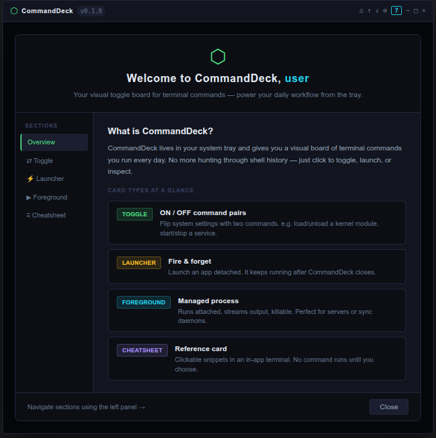

# Starter Pack + Help Modal Design

**Date:** 2026-05-22
**Status:** Approved — ready for implementation

## Overview

Two tightly related features:

1. **Starter Pack** — platform-specific default `commands.json` auto-populated on first run, giving new users an immediately useful board without any setup.
2. **Help Modal** — a `?` button in the titlebar that opens a welcome/reference screen explaining what CommandDeck does and how each card type works, with context-aware "Recreate" buttons for any missing starter commands.

### Goal

New users should feel like they've been handed the tool with a good set of real value — not a blank slate. The help modal reinforces this by explaining the tool in the context of the examples they already have in front of them.

---

## Part 1: Starter Commands

### Delivery mechanism

On first run (when `~/.commanddeck/commands.json` does not exist), `loadConfig()` reads the platform-appropriate bundled default and writes it to disk before returning. No separate "have I seen the welcome screen" flag is stored — first-run is derivable from whether the config file existed.

`loadConfig()` return type gains two new fields:
```js
{ commands: [...], firstRun: boolean, platform: string }
```

`firstRun` is `true` only when the file was absent and just created. `platform` is `process.platform` (`"linux"` / `"darwin"` / `"win32"`), needed by the renderer to know which starter set to reference for recreate detection.

### Bundled default files

Three new files in `src/defaults/`:
- `commands-linux.json`
- `commands-mac.json`
- `commands-windows.json`

Each contains 5 commands — one launcher, one foreground, one cheatsheet, and two toggles (the type that benefits most from concrete examples). All starter IDs use the prefix `starter-` followed by a short descriptive slug. The ID validator in `validate-config.js` must be relaxed to allow hyphens (see Validator section below).

### Linux starter commands

Ubuntu 22 primary target; commands chosen for broad distro compatibility. Linux `note` fields carry distro-dependency caveats since the platform is less controlled than macOS/Windows.

```json
[
  {
    "id": "starter-linux-audio-loopback",
    "label": "Audio Loopback",
    "note": "Routes mic to speakers. Requires PulseAudio or PipeWire (standard on Ubuntu, Fedora, Arch).",
    "type": "toggle",
    "tags": ["Audio"],
    "onCmd": "pactl load-module module-loopback latency_msec=1",
    "offCmd": "pactl unload-module module-loopback"
  },
  {
    "id": "starter-linux-wifi",
    "label": "Wi-Fi",
    "note": "Requires NetworkManager (standard on most desktop distros).",
    "type": "toggle",
    "tags": ["Network"],
    "onCmd": "nmcli radio wifi on",
    "offCmd": "nmcli radio wifi off"
  },
  {
    "id": "starter-linux-home-folder",
    "label": "Open Home Folder",
    "note": "Opens your default file manager — works across GNOME, KDE, XFCE, and others.",
    "type": "launcher",
    "tags": ["Apps"],
    "launchCmd": "xdg-open ~"
  },
  {
    "id": "starter-linux-system-monitor",
    "label": "System Monitor",
    "note": "Install if needed: sudo apt install htop (or dnf/pacman equivalent).",
    "type": "foreground",
    "tags": ["System"],
    "onCmd": "htop"
  },
  {
    "id": "starter-linux-network-toolkit",
    "label": "Network Toolkit",
    "note": "Common network diagnostics. nmap requires separate installation.",
    "type": "cheatsheet",
    "tags": ["Network"],
    "content": "ip addr show\nip route\nss -tulnp\ncurl ifconfig.me\nnmap -sn 192.168.1.0/24"
  }
]
```

### macOS starter commands

Guaranteed to work on any modern macOS (Ventura+). No distro caveats needed.

```json
[
  {
    "id": "starter-mac-dark-mode",
    "label": "Dark Mode",
    "note": "Toggles system-wide dark/light appearance.",
    "type": "toggle",
    "tags": ["Appearance"],
    "onCmd": "osascript -e 'tell app \"System Events\" to tell appearance preferences to set dark mode to true'",
    "offCmd": "osascript -e 'tell app \"System Events\" to tell appearance preferences to set dark mode to false'"
  },
  {
    "id": "starter-mac-wifi",
    "label": "Wi-Fi",
    "note": "Turns the Wi-Fi radio on or off.",
    "type": "toggle",
    "tags": ["Network"],
    "onCmd": "networksetup -setairportpower en0 on",
    "offCmd": "networksetup -setairportpower en0 off"
  },
  {
    "id": "starter-mac-finder",
    "label": "Open Home Folder",
    "note": "Opens your home directory in Finder.",
    "type": "launcher",
    "tags": ["Apps"],
    "launchCmd": "open ~"
  },
  {
    "id": "starter-mac-keep-awake",
    "label": "Keep Awake",
    "note": "Prevents the display from sleeping while running. Kill to allow sleep again.",
    "type": "foreground",
    "tags": ["System"],
    "onCmd": "caffeinate -d"
  },
  {
    "id": "starter-mac-network-toolkit",
    "label": "Network Toolkit",
    "note": "Common network diagnostics for macOS.",
    "type": "cheatsheet",
    "tags": ["Network"],
    "content": "ifconfig\nnetstat -rn\ncurl ifconfig.me\nnetworksetup -listallnetworkservices\nscutil --dns"
  }
]
```

### Windows starter commands

Guaranteed to work on Windows 10/11. The Wi-Fi toggle uses the interface name `"Wi-Fi"` — the note field explains how to find the correct name if it differs.

```json
[
  {
    "id": "starter-win-dark-mode",
    "label": "Dark Mode",
    "note": "Toggles app dark/light theme via registry.",
    "type": "toggle",
    "tags": ["Appearance"],
    "onCmd": "reg add HKCU\\SOFTWARE\\Microsoft\\Windows\\CurrentVersion\\Themes\\Personalize /v AppsUseLightTheme /t REG_DWORD /d 0 /f",
    "offCmd": "reg add HKCU\\SOFTWARE\\Microsoft\\Windows\\CurrentVersion\\Themes\\Personalize /v AppsUseLightTheme /t REG_DWORD /d 1 /f"
  },
  {
    "id": "starter-win-wifi",
    "label": "Wi-Fi",
    "note": "Interface name may vary — run 'netsh interface show interface' to find yours.",
    "type": "toggle",
    "tags": ["Network"],
    "onCmd": "netsh interface set interface \"Wi-Fi\" enabled",
    "offCmd": "netsh interface set interface \"Wi-Fi\" disabled"
  },
  {
    "id": "starter-win-file-explorer",
    "label": "Open Home Folder",
    "note": "Opens your home directory in File Explorer.",
    "type": "launcher",
    "tags": ["Apps"],
    "launchCmd": "explorer.exe ."
  },
  {
    "id": "starter-win-ping-monitor",
    "label": "Ping Monitor",
    "note": "Continuous connectivity check — streams output to the in-app terminal.",
    "type": "foreground",
    "tags": ["Network"],
    "onCmd": "ping -t 8.8.8.8"
  },
  {
    "id": "starter-win-network-toolkit",
    "label": "Network Toolkit",
    "note": "Common network diagnostics for Windows.",
    "type": "cheatsheet",
    "tags": ["Network"],
    "content": "ipconfig /all\nnetstat -an\ntracert 8.8.8.8\nnslookup google.com\narp -a"
  }
]
```

---

## Part 2: First-Run Auto-Population

### Changes to `src/main/config-io.js`

`loadConfig()` currently returns `{ commands }` and falls back to `{ commands: [] }` when the file doesn't exist. It is extended to:

1. Check if the file exists before attempting to read it.
2. If absent: read `src/defaults/commands-{platform}.json`, write it to `~/.commanddeck/commands.json`, return `{ commands, firstRun: true, platform: process.platform }`.
3. If present: read and parse as before, return `{ commands, firstRun: false, platform: process.platform }`.

`platform` is always included so the renderer knows which starter set to reference.

### IPC chain

The `loadConfig` IPC handler in `ipc-handlers.js` passes `firstRun` and `platform` through unchanged. The `preload.js` `loadConfig` binding passes them to the renderer. No new IPC channels are needed.

### Renderer boot (`app.js`)

```js
const { commands, firstRun, platform } = await window.api.loadConfig();
// ... render cards ...
if (firstRun) openHelpModal({ commands, platform });
```

`openHelpModal` is only called here on first run. After that, it's only triggered by the `?` button.

---

## Part 3: Help Modal

### Visual design

Approved mockup screenshot is the canonical reference for implementation:



Key elements:
- **Hero header:** `⬡` icon (accent green, 32px), `"Welcome to CommandDeck, "` + `"user"` (cyan `#22d3ee`), tagline below in dim text
- **Left nav:** 130px, dark background, section items for Overview / Toggle / Launcher / Foreground / Cheatsheet with active state (green left-border, green text)
- **Content area:** flex-1, scrollable, renders section content dynamically
- **Footer:** "Close" button right-aligned; "Navigate sections using the left panel →" hint left-aligned

### New file: `src/renderer/help-modal.js`

ES module. Exports:
- `initHelpModal({ getConfig, getPlatform, saveConfig, renderCards })` — called once at boot, wires up close button and injects dependencies
- `openHelpModal()` — opens the modal, renders the active section
- `closeHelpModal()` — hides the modal

The module holds its own `activeSection` state (defaults to `'overview'`). It reads current config via `getConfig()` at open time (not stored) so recreate state is always fresh.

### Markup added to `index.html`

A new `#help-backdrop` / `#help-modal` block following the same modal pattern as the existing edit and prefs modals. The hero, nav, content, and footer are static HTML; only the content area inner HTML is replaced by JS on section switch.

### `?` button in titlebar

Added to `index.html` immediately after `#btn-prefs`:
```html
<button class="tb-btn" id="btn-help" title="Help &amp; Getting Started">?</button>
```

Wired in `app.js` to call `openHelpModal()`.

### Section content

Each section is a JS object in `help-modal.js` — title, description, and an array of starter example definitions (label, type badge color, description, note, starter ID).

**Overview section:** Intro paragraph + four card-type summary rows (each with colored type badge, bold name, one-line description). No recreate buttons.

**Type sections (Toggle / Launcher / Foreground / Cheatsheet):** Explanation of the type, then the starter example card for the current platform. If the starter's ID is absent from current config, a cyan `RECREATE` button renders inline.

Card-type badge colors:
- TOGGLE: `#4ade80` (existing accent green)
- LAUNCHER: `#fbbf24` (existing warn amber)
- FOREGROUND: `#22d3ee` (existing cyan)
- CHEATSHEET: `#a78bfa` (new violet, only used here)

### Recreate button

On click:
1. Retrieve the full starter command object for the current platform and section
2. Append it to the current config via `saveConfig({ commands: [...getConfig(), starterCmd] })`
3. Call `renderCards()` to refresh the board
4. Re-render the current section (button disappears, replaced by a confirmation state)

Modal stays open — users may want to recreate multiple items.

---

## Part 4: Validator Update

`src/main/validate-config.js` line 1:

```js
// Before:
const VALID_ID = /^[0-9a-z]{1,32}$/;

// After:
const VALID_ID = /^[0-9a-z][0-9a-z-]{0,31}$/;
```

Allows hyphens anywhere after the first character. Starter IDs like `starter-linux-wifi` pass; pure-alphanumeric UIDs from `uid()` continue to pass unchanged.

---

## Files Changed / Added

| File | Change |
|---|---|
| `src/defaults/commands-linux.json` | **NEW** — 5 Linux starter commands |
| `src/defaults/commands-mac.json` | **NEW** — 5 macOS starter commands |
| `src/defaults/commands-windows.json` | **NEW** — 5 Windows starter commands |
| `src/renderer/help-modal.js` | **NEW** — `initHelpModal`, `openHelpModal`, `closeHelpModal` |
| `src/main/config-io.js` | Add first-run detection, read platform default, return `firstRun` + `platform` |
| `src/main/ipc-handlers.js` | Pass `firstRun` + `platform` through from `loadConfig` |
| `src/main/preload.js` | `loadConfig` return type includes `firstRun` + `platform` |
| `src/main/validate-config.js` | Relax `VALID_ID` regex to allow hyphens |
| `src/renderer/index.html` | Add `#btn-help` to titlebar; add `#help-backdrop`/`#help-modal` markup |
| `src/renderer/app.js` | Wire `#btn-help`; call `openHelpModal()` on first run; `initHelpModal` at boot |
| `src/renderer/style.css` | Add `.help-*` styles; add `#a78bfa` cheatsheet badge |
| `docs/assets/help-modal-screenshot.png` | **NEW** — approved mockup screenshot (implementation reference) |

---

## Out of Scope

- Localization / i18n of help text
- User-editable help content
- "Reset to defaults" option (would recreate all starters at once)
- Packaging / distribution (separate feature)
